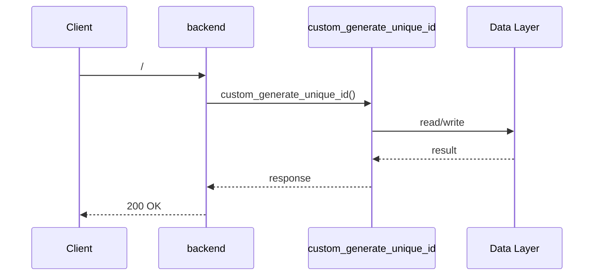

# I2 — End-to-end flow trace (external repo)

Source: `/tmp/ext-eval-repo/backend` — scanned with `polyglot_eval.repo_scanner` (AST, no model calls).

**2 entry point(s) · 18 routes · 15 flow steps.**

## Entry points

| File | Function | Line |
| --- | --- | --- |
| app/main.py | `custom_generate_unique_id` | 1 |
| app/api/main.py | `main` | 1 |

## Routes (externally exposed)

`/`, `/health-check/`, `/items`, `/login/access-token`, `/login/test-token`, `/me`, `/me/password`, `/password-recovery-html-content/{email}`, `/password-recovery/{email}`, `/private`, `/reset-password/`, `/signup`, `/test-email/`, `/users`, `/users/`, `/utils`, `/{id}`, `/{user_id}`

## Step-by-step path

| # | File | Function | Line | I/O |
| --- | --- | --- | --- | --- |
| 1 | app/main.py | `custom_generate_unique_id` | 1 | http_call |
| 2 | app/api/main.py | `main` | 1 | http_call |
| 3 | app/main.py | `/` | 1 | http_call |
| 4 | app/main.py | `/health-check/` | 1 | http_call |
| 5 | app/main.py | `/items` | 1 | http_call |
| 6 | app/main.py | `/login/access-token` | 1 | http_call |
| 7 | app/main.py | `/login/test-token` | 1 | http_call |
| 8 | app/main.py | `/me` | 1 | http_call |
| 9 | app/main.py | `/me/password` | 1 | http_call |
| 10 | app/main.py | `/password-recovery-html-content/{email}` | 1 | http_call |
| 11 | app/models.py | `get_datetime_utc` | 9 | None |
| 12 | app/backend_pre_start.py | `init` | 22 | None |
| 13 | app/backend_pre_start.py | `main` | 32 | None |
| 14 | app/initial_data.py | `init` | 11 | None |
| 15 | app/initial_data.py | `main` | 16 | None |

## Sequence diagram

